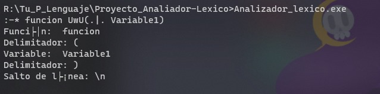
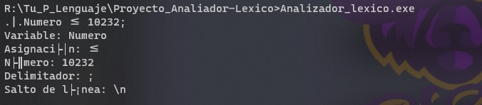
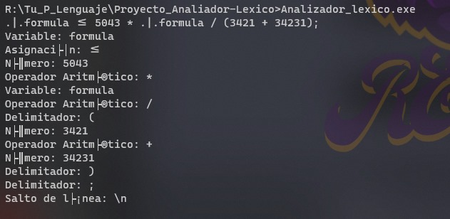
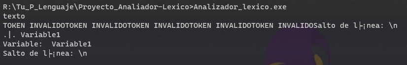
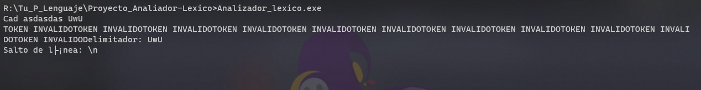

## Analizador Léxico TU_P_L

Para la ejecución de este analizador es necesario instalar FLEX. 

Es neceario ingresar la siguiente línea de código para compilar el analizador


```
gcc -o Analizador_lexico lex.yy.c -1fl
```

y lo siguiente para ejecutar

```
./Analizador_lexico.exe
```

A continuación se muestran ejemplos de ejecución del analizador.


### Entradas válidas
<div align="center">
<br>
<br>
<p align="center">
  
</p>
<br>
<br>

<br>
<br>
<p align="center">
  
</p>
<br>
<br>

<br>
<br>
<p align="center">
  
</p>
<br>
<br>


### Entradas no válidas
<br>
<br>
<p align="center">
  
</p>
<br>
<br>


<br>
<br>
<p align="center">
  
</p>
<br>
<br>
</div>
