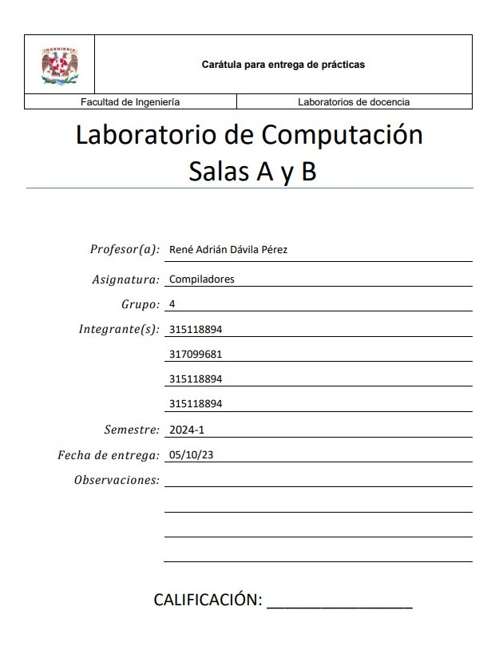
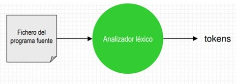

## Carátula para Entrega de Prácticas   (SE ACTUALIZARÁ)           

<div align="center">
<br>
<br>
<p align="center">
  
</p>
<br>
<br>
</div>

## Introducción

Un analizador léxico o scanner, es un programa que analiza el texto fuente de un programa informático y lo divide en unidades más pequeñas, llamadas tokens. Estas unidades son los elementos básicos de un lenguaje de programación, como palabras reservadas, identificadores, operadores, literales, etc.

El analizador léxico es la primera etapa en el proceso de compilación de un programa informático. Su función es identificar los tokens que forman el código fuente y generar un flujo de tokens que será utilizado por el siguiente paso en el proceso de compilación, el analizador sintáctico.

 
Un scanner se puede desarrollar con distintos métodos:
-	Con un autómata finito
-	Con un programa a medida
-	Utilizando una herramienta específica como Flex

<div align="center">
<br>
<br>
<p align="center">
  
</p>
<br>
<br>
</div>

En este trabajo se expondrá un analizador léxico (scanner) que procesa un lenguaje llamado “Tu_P_L”, un lenguaje en español. Para este proyecto se hará uso de la herramienta “FLEX”, ya que hacer un autómata finito es una tarea increíblemente laboriosa y FLEX proporciona las herramientas necesarias para construir de forma sencilla el analizador léxico. 


## Hipotesis
La implementación de un analizador léxico para el lenguaje específico propuesto permitirá analizar y dividir de manera efectiva y precisa el código fuente escrito en este lenguaje en una secuencia de tokens, que incluirán palabras reservadas, operadores aritméticos y relacionales, asignaciones, delimitadores, espacios, variables, cadenas, números y funciones, según las reglas de la gramática definida para este lenguaje.
### Objetivos y Expectativas del Analizador Léxico:
1. **Reconocimiento de Palabras Reservadas:** El analizador léxico deberá identificar y clasificar correctamente las palabras reservadas, como "entero," "buleano," "flotante," "SI," "EntonCes," "Para," y "MiEntras." Estas palabras reservadas serán tokens fundamentales para definir la estructura y el flujo del programa.
2. **Identificación de Operadores Aritméticos y Relacionales:** El analizador léxico deberá detectar los operadores aritméticos ("+", "*", "-", "/") y los operadores relacionales ("<", ">", "=3", "E=)", "W!") cuando aparezcan en el código fuente.
3. **Manejo de Asignaciones:** El analizador léxico deberá ser capaz de reconocer y clasificar correctamente las asignaciones representadas por "<=".
4. **Delimitadores y Espacios:** Deberá identificar y gestionar adecuadamente los delimitadores ("UwU," "(", ")") y los espacios en blanco ("\t," "\n," " ") que puedan aparecer en el código
5. **Identificación de Variables:** El analizador léxico deberá reconocer las variables representadas por el patrón ".|." y asignarles un token correspondiente.
6. **Reconocimiento de Cadenas:** Deberá identificar y clasificar las cadenas de caracteres, marcadas por "CaD," como tokens válidos.
7. **Detección de Números:** El analizador léxico deberá identificar secuencias de dígitos ([0-9]+) y considerarlas como tokens de números válidos.
8. **Identificación de Funciones:** Deberá reconocer las funciones definidas por ":-*" y generar tokens correspondientes para representarlas en el análisis posterior.
Se espera que el analizador léxico funcione de manera eficiente incluso para programas largos y complejos, procesando el código fuente de manera rápida y sin consumo excesivo de recursos. El analizador léxico propuesto tiene como objetivo fundamental dividir el código fuente escrito en el lenguaje específico en una secuencia de tokens válidos. Su éxito se medirá por su capacidad para reconocer y clasificar los elementos léxicos del lenguaje según las reglas definidas

## Desarrollo

Para la construcción del lenguaje "Tu_P_L" primero se tiene que definir cómo será el lenguaje.

Se definio lo siguiente.

Palabras reservadas:
-	"entero"
-	"buleano"
-	"flotante"
-	"SI"
-	"EntonCes"
-	"Para"
-	"MiEntras"

Operadores aritméticos:
- "+"
- "*"
- "-"
- "/"

Operadores relacionales:
- "<" (menor que)
- ">" (mayor que)
- "(=3" (menor o igual que)
- "E=)" (mayor o igual que)
- "W!" (diferente de )

Asignación
- "<=" (igual a)

Delimitadores:
- "UwU"
- "("
- ")"

Espacios
- "\t"
- "\n"
- “ “

Variable
- ".|."

Cadena
- "CaD"

Número
- "[0-9]+"

Función
- ":-*"


```c
# Esto es un bloque de código en C
printf("Hola, mundo, esta es una prueba!");
```

## Referencias
>>>>>>> Stashed changes
