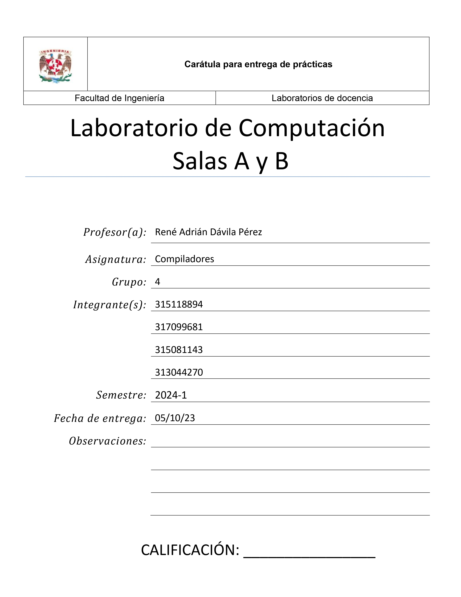

## Carátula para Entrega de Prácticas   (SE ACTUALIZARÁ)           

<div align="center">
<br>
<br>
<p align="center">
  
</p>
<br>
<br>
</div>

## Introducción

Un analizador léxico o scanner, es un programa que analiza el texto fuente de un programa informático y lo divide en unidades más pequeñas, llamadas tokens. Estas unidades son los elementos básicos de un lenguaje de programación, como palabras reservadas, identificadores, operadores, literales, etc.

El analizador léxico es la primera etapa en el proceso de compilación de un programa informático. Su función es identificar los tokens que forman el código fuente y generar un flujo de tokens que será utilizado por el siguiente paso en el proceso de compilación, el analizador sintáctico.

 
Un scanner se puede desarrollar con distintos métodos:
-	Con un autómata finito
-	Con un programa a medida
-	Utilizando una herramienta específica como Flex

<div align="center">
<br>
<br>
<p align="center">
  
</p>
<br>
<br>
</div>

En este trabajo se expondrá un analizador léxico (scanner) que procesa un lenguaje llamado “Tu_P_L”, un lenguaje en español. Para este proyecto se hará uso de la herramienta “FLEX”, ya que hacer un autómata finito es una tarea increíblemente laboriosa y FLEX proporciona las herramientas necesarias para construir de forma sencilla el analizador léxico. 


### Hipotesis

La implementación exitosa de un analizador léxico en C permitirá procesar el código fuente de programas escritos en el lenguaje Tu_P_L, identificando y clasificando correctamente los tokens, incluyendo palabras reservadas, identificadores, números y símbolos, de acuerdo con las reglas de la gramática del lenguaje. 
 
 Además, el analizador léxico será capaz de proporcionar mensajes de error informativos cuando se encuentren tokens inválidos o estructuras de código incorrectas.

## Desarrollo

Para la construcción del lenguaje "Tu_P_L" primero se tiene que definir cómo será el lenguaje.

Se definio lo siguiente.

Palabras reservadas:
-	"entero"
-	"buleano"
-	"flotante"
-	"SI"
-	"EntonCes"
-	"Para"
-	"MiEntras"

Operadores aritméticos:
- "+"
- "*"
- "-"
- "/"

Operadores relacionales:
- "<" (menor que)
- ">" (mayor que)
- "(=3" (menor o igual que)
- "E=)" (mayor o igual que)
- "W!" (diferente de )

Asignación
- "<=" (igual a)

Delimitadores:
- "UwU"
- "("
- ")"

Espacios
- "\t"
- "\n"
- “ “

Variable
- ".|."

Cadena
- "CaD"

Número
- "[0-9]+"

Función
- ":-*"


```c
# Esto es un bloque de código en C
printf("Hola, mundo, esta es una prueba!");
```

## Referencias
>>>>>>> Stashed changes
