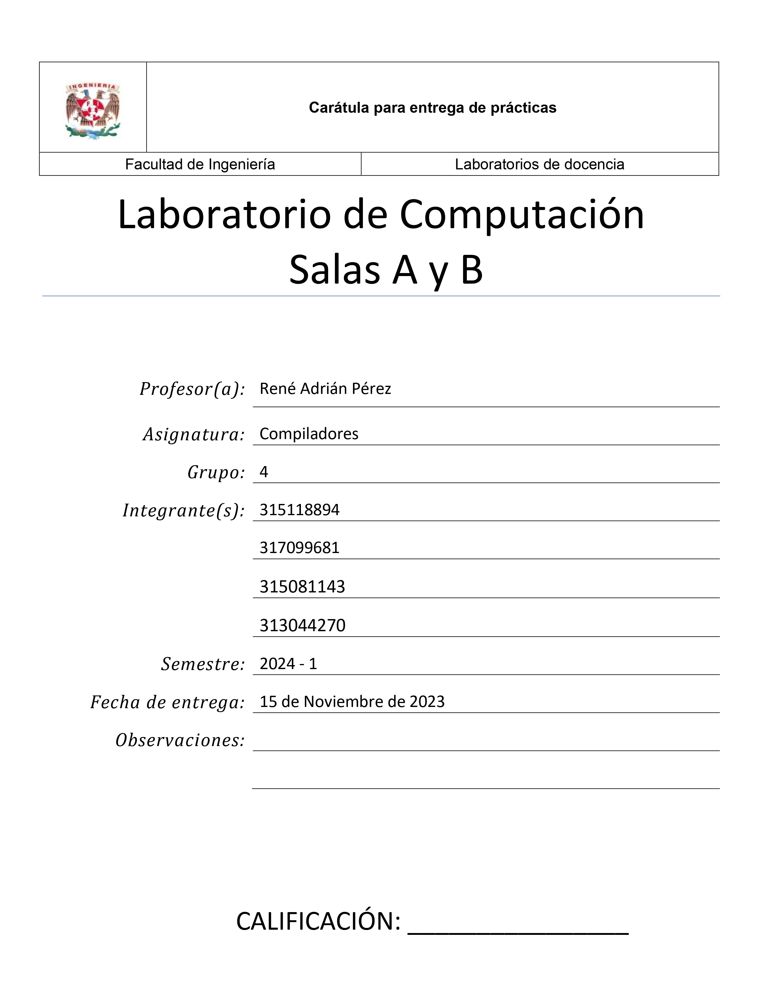

<div align="center">
<br>
<br>
<p align="center">
  
</p>
<br>
<br>
</div>
# Analizador-Sintactico
## 1. Introducción

Documentación de proyecto, una implementación de un analizador sintáctico en Python utilizando PLY (Python Lex-Yacc). Este proyecto tiene como objetivo principal proporcionar una herramienta educativa para el aprendizaje académico del funcionamiento interno de los analizadores sintácticos y cómo se pueden implementar en el contexto de compiladores.

## Objetivos del Aprendizaje
- Proporcionar una implementación educativa de un analizador sintáctico utilizando PLY.
- Facilitar la comprensión de los principios teóricos detrás de los analizadores sintácticos y la generación de código.
- Ofrecer ejemplos prácticos que ilustren funcina un analizador sintáctico en un compilador.

## Implementación en un Compilador
La capacidad de integrar un analizador sintáctico en un compilador es una competencia clave para aquellos que buscan desarrollar software que traduzca código fuente a código ejecutable. A lo largo de esta documentación, exploraremos cómo puede integrarse este analizador sintáctico en un contexto más amplio de compilación, proporcionando ejemplos y pautas para facilitar la comprensión práctica.

## Breve Descripción de PLY y Propósito
PLY (Python Lex-Yacc) es una herramienta que combina la funcionalidad de Lex (analizador léxico) y Yacc (analizador sintáctico) en el entorno de programación Python. Su propósito es facilitar la creación de analizadores léxicos y sintácticos para procesar lenguajes formales. En este proyecto, utilizamos PLY para construir un analizador sintáctico que pueda ser educativo y aplicado en el desarrollo de compiladores.

## 2. Instalación
Para comenzar a utilizar nuestro analizador sintáctico basado en PLY, sigue estos pasos de instalación:

1. **Instala Python:**
   Asegúrate de tener Python instalado en tu sistema. Puedes descargar la última versión de Python desde [el sitio oficial de Python](https://www.python.org/downloads/).

2. **Instala PLY:**
   Puedes instalar PLY utilizando el administrador de paquetes de Python, pip. Abre una terminal o línea de comandos y ejecuta el siguiente comando:
   ```bash
   pip install ply

## 3. Uso básico
Ejemplos sencillos de cómo usar tu analizador sintáctico. Puedes incluir fragmentos de código y explicaciones paso a paso.

## 4. Estructura del código
Una descripción general de la estructura de tu código. Divide el código en módulos y explica la función de cada uno.

## 5. Gramática
Incluye una descripción de la gramática que tu analizador sintáctico está diseñado para manejar. Puedes utilizar gramáticas de ejemplo para ilustrar.

## 6. Detalles técnicos
### 6.1 Yacc (Yet Another Compiler Compiler
Yacc es una herramienta de generación de analizadores sintácticos (parsers) que se utiliza comúnmente en la construcción de compiladores y analizadores para lenguajes de programación. Fue desarrollado como parte del sistema Unix y es parte del conjunto de herramientas conocido como "Lex and Yacc" (o "Flex and Bison" en sus versiones más modernas).

* Definición de la Gramática: En el contexto de Yacc, la gramática se define mediante reglas de producción. Estas reglas describen la estructura sintáctica del lenguaje que se está analizando.

* Especificación de Acciones Semánticas: Junto con las reglas de producción, se especifican acciones semánticas en forma de código en algún lenguaje de programación (como C o Python). Estas acciones se ejecutan cuando se encuentra una coincidencia con una regla de producción específica.

* Generación del Analizador Sintáctico: Yacc utiliza la gramática y las acciones semánticas para generar un analizador sintáctico en el lenguaje de programación elegido. Este analizador es capaz de analizar secuencias de tokens y construir una estructura de árbol sintáctico que representa la estructura del programa fuente.

* Integración con el Analizador Léxico (Lex): Comúnmente, Yacc se utiliza junto con Lex (o herramientas similares) para construir un analizador léxico que proporciona los tokens al analizador sintáctico.

## 7. Ejemplos avanzados
Proporciona ejemplos más complejos de uso. Muestra cómo manejar casos especiales o construcciones sintácticas más avanzadas.

## 8. Errores y manejo de excepciones
Describe cómo manejas errores y excepciones en tu analizador. Proporciona ejemplos de mensajes de error y cómo interpretarlos.

## 10. Referencias

[1](https://www.dabeaz.com/ply/ply.html)D. Beazley, "PLY (Python Lex-Yacc)," [En línea]. Disponible en: https://www.dabeaz.com/ply/ply.html

