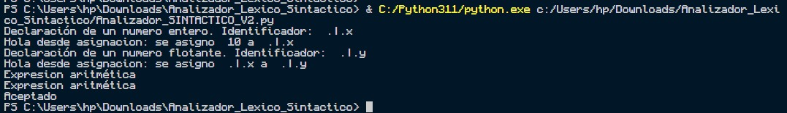
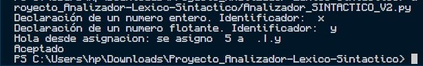

<div align="center">
<br>
<br>
<p align="center">
  
</p>
<br>
<br>
</div>

# Analizador-Sintactico

## 1. Introducción

Documentación de proyecto, una implementación de un analizador sintáctico en Python utilizando PLY (Python Lex-Yacc). Este proyecto tiene como objetivo principal proporcionar una herramienta educativa para el aprendizaje académico del funcionamiento interno de los analizadores sintácticos y cómo se pueden implementar en el contexto de compiladores

## Objetivos del Aprendizaje
- Proporcionar una implementación educativa de un analizador sintáctico utilizando PLY
- Facilitar la comprensión de los principios teóricos detrás de los analizadores sintácticos y la generación de código
- Ofrecer ejemplos prácticos que ilustren funcina un analizador sintáctico en un compilador

## Implementación en un Compilador
La capacidad de integrar un analizador sintáctico en un compilador es una competencia clave para aquellos que buscan desarrollar software que traduzca código fuente a código ejecutable. A lo largo de esta documentación, exploraremos cómo puede integrarse este analizador sintáctico en un contexto más amplio de compilación, proporcionando ejemplos y pautas para facilitar la comprensión práctica

## Breve Descripción de PLY y Propósito
PLY (Python Lex-Yacc) es una herramienta que combina la funcionalidad de Lex (analizador léxico) y Yacc (analizador sintáctico) en el entorno de programación Python. Su propósito es facilitar la creación de analizadores léxicos y sintácticos para procesar lenguajes formales. En este proyecto, utilizamos PLY para construir un analizador sintáctico que pueda ser educativo y aplicado en el desarrollo de compiladores

## 2. Instalación
Para comenzar a utilizar nuestro analizador sintáctico basado en PLY, sigue estos pasos de instalación:

1. **Instala Python:**
   Asegúrate de tener Python instalado en tu sistema. Puedes descargar la última versión de Python desde [el sitio oficial de Python](https://www.python.org/downloads/).

2. **Instala PLY:**
   Puedes instalar PLY utilizando el administrador de paquetes de Python, pip. Abre una terminal o línea de comandos y ejecuta el siguiente comando:
   ```bash
   pip install ply

## 3. Uso básico
para usar el parse se tendra que modificar la variable 
```python
data = '''    '''
```
### 3.1 Ejemplo 1
para este ejemplo usaremos la siguiente sentencia
```python
# Prueba con un programa de ejemplo
data='''entero .|.x ;
        .|.x <= 10;
        flotante .|.y;
        .|.y <= .|.x;
        10 + 10;
        (50 * 10 + 5);
        '''
```
al ejecutar el codigo la consola nos mostrara lo siguiente
<div align="center">
<br>
<br>
<p align="center">
  
</p>
<br>
<br>
</div>
donde, se describe la declaraciones, las asignaciones, una declaracion de un numero flotante y la exprecion arietmetica, por ultimo la line nos dice *Aceptado*

### 3.2 Ejemplo 2
para esta ejecion se usara una declaracion sencilla de una variable
```python
# Prueba con un programa de ejemplo
data='''
        entero x ;
        flotante y;
        .|.y <= 5;
        '''
```
<div align="center">
<br>
<br>
<p align="center">
  
</p>
<br>
<br>
</div>
donde muesta la declaracion de un numero entero con el id 'x' y una delcaracion de un numero flotante con el id 'y'
y la asignacion nos muestra que el numero 5 se asigno a la variable 'y' y termina la ejecucion con un *Aceptado*

## 4. Estructura del código
### 4.1 Definición de Precedencia
Esta sección establece cómo se deben interpretar y evaluar las expresiones en términos de la precedencia de los operadores, lo cual es crucial para garantizar que las expresiones se analicen correctamente y sigan la lógica esperada
  ```python
# Definición de precedencia y reglas de producción
precedence = (
    # Definir precedencia de operadores
    ('left', 'SUMA', 'MENOS'),
    ('left', 'MULTIPLICACION', 'ENTRE'),
    ('right', 'UMINUS'),
    ('left', 'MENOR_QUE', 'MAYOR_QUE', 'MENOR_O_IGUAL_QUE', 'MAYOR_O_IGUAL_QUE', 'DIFERENTE_DE', 'IGUAL_A'),
)
```
* La sección define la precedencia de los operadores en tu lenguaje. Esto es crucial para resolver ambigüedades en la gramática y determinar el orden de evaluación de los operadores. La notación ('left', ...) indica asociatividad de izquierda para los operadores listados, mientras que ('right', ...) indica asociatividad de derecha
* se ha definido la precedencia para operadores aritméticos (SUMA, MENOS, MULTIPLICACION, ENTRE), el operador unario negativo (UMINUS), y operadores de comparación (MENOR_QUE, MAYOR_QUE, MENOR_O_IGUAL_QUE, MAYOR_O_IGUAL_QUE, DIFERENTE_DE, IGUAL_A).

### 4.2 Reglas de producción
El bloque de código que comienza con def p_programa(p): y continúa con varias funciones que comienzan con p_ se refiere a las reglas de producción de tu analizador sintáctico utilizando PLY

```python
def p_programa(p):
    'programa : declaraciones'
```
* Esta regla establece que un programa (programa) está compuesto por una secuencia de declaraciones (declaraciones). La parte entre comillas simples ('programa : declaraciones') es la definición de la regla en términos de la gramática del lenguaje

1. Esta regla define el punto de entrada para el análisis sintáctico (inicio). Establece que un programa comienza con la regla principal. Cuando se alcanza esta regla, imprime "Aceptado"
```python
def p_inicio(p):
    '''inicio : principal'''
    print("Aceptado")
```
2. Esta regla define las posibles construcciones que pueden aparecer en la parte principal del código. Puede ser una variable de declaración, una variable de asignación o una expresión aritmética. La recursividad permite la presencia de múltiples instrucciones en la parte principal del programa
```python
def p_principal(p):
    '''principal : variable_declaracion principal
                 | variable_asignacion principal
                 | exp_aritmetica principal
                 | variable_declaracion
                 | variable_asignacion 
                 | exp_aritmetica '''
```
3. Esta regla define cómo se debe declarar una variable. Reconoce la palabra clave ENTERO, FLOTANTE o BULEANO, seguida de un identificador (ID) y un delimitador (DELIMITADOR). Dependiendo del tipo de variable, imprime un mensaje indicando la declaración y el identificador
```python
def p_variable_declaracion(p):
    '''variable_declaracion : ENTERO ID DELIMITADOR
                            | FLOTANTE ID DELIMITADOR
                            | BULEANO ID DELIMITADOR'''
```
4. Esta regla define cómo se debe realizar la asignación de variables. Puede asignar un número o el valor de otra variable a una variable existente. Imprime un mensaje indicando la asignación
```python
def p_variable_asignacion(p):
    '''variable_asignacion : ID ASIGNACION NUMERO DELIMITADOR
                          | ID ASIGNACION ID DELIMITADOR'''
```
5. Esta regla define la estructura de una expresión aritmética. Imprime un mensaje indicando la presencia de una expresión aritmética
```python
def p_exp_aritmetica(p):
    '''exp_aritmetica : expresion DELIMITADOR'''
```
6. Esta regla define las diferentes formas en que pueden aparecer expresiones, incluyendo sumas y restas. Se basa en la regla de expresiones aritméticas
```python
def p_expresion(p):
    '''expresion : expresion SUMA termino
                 | expresion MENOS termino
                 | termino'''
```
7. Esta regla define cómo se deben combinar términos en expresiones. Puede incluir multiplicación o división
```python
def p_termino(p):
    '''termino : termino MULTIPLICACION factor
                | termino ENTRE factor
                | factor'''
```
8. Esta regla define los factores que pueden aparecer en expresiones. Puede ser un número o una expresión entre paréntesis
```python
def p_factor(p):
    '''factor : NUMERO 
               | PARENTESIS_IZQ expresion PARENTESIS_DER'''
```
9. Esta regla maneja errores sintácticos e imprime un mensaje indicando el tipo de error y el token involucrado
```python
def p_error(p):
    print(f"Error de sintaxis en el token: {p}")
```

## 5. Gramática
La gramática utilizada en el analizador sintáctico PLY de este proyecto se presenta a continuación. Estas reglas de producción describen la estructura sintáctica del lenguaje que el analizador es capaz de reconocer

1. Un programa está compuesto por declaraciones
  - **programa** -> declaraciones
2. Las declaraciones pueden ser una declaración seguida de un salto de línea
  -  **declaraciones** -> declaracion SALTO_DE_LINEA
3. Una declaración puede ser una declaración de variable o una declaración de función
  -  **declaracion** -> declaracion_variable | declaracion_funcion
4. Una declaración de variable comienza con un tipo seguido de un nombre de variable y termina con un delimitador
  -  **declaracion_variable** -> tipo VARIABLE DELIMITADOR
5. El tipo de variable puede ser ENTERO, BULEANO o FLOTANTE
  -  **tipo** -> ENTERO | BULEANO | FLOTANTE
6. Una declaración de función comienza con la palabra clave FUNCION, seguida de paréntesis que contienen parámetros, un bloque de función y termina con un delimitador
  -  **declaracion_funcion** -> FUNCION PARENTESIS_IZQ parametros PARENTESIS_DER bloque_funcion DELIMITADOR
7. Los parámetros de una función pueden ser nulos (ε) o una lista de variables separadas por comas
  -  **parametros** -> ε | parametros VARIABLE | parametros VARIABLE parametros
8. Un bloque de función está contenido entre paréntesis y contiene expresiones
  -  **bloque_funcion** -> PARENTESIS_IZQ expresiones PARENTESIS_DER
9. Las expresiones pueden ser una sola expresión o una secuencia de expresiones
  -  **expresiones** -> expresion | expresiones expresion
10. Aquí se detallan las reglas para diversas operaciones y elementos que pueden formar una expresión, incluyendo operadores aritméticos, comparativos, variables, números, cadenas y construcciones como condicionales y bucles
  - **expresion** -> expresion SUMA expresion | expresion MULTIPLICACION expresion | expresion MENOS expresion | expresion ENTRE expresion | expresion MENOR_QUE expresion | expresion MAYOR_QUE expresion | expresion MENOR_O_IGUAL_QUE expresion | expresion MAYOR_O_IGUAL_QUE expresion | expresion DIFERENTE_DE expresion | expresion IGUAL_A expresion | VARIABLE | NUMERO | CADENA | condicional | bucle_mientras | bucle_para | expresion_unaria | expresion_parentesis
11. Los argumentos de una función pueden ser nulos (ε) o una lista de expresiones separadas por comas
  -  **argumentos** -> ε | argumentos expresion | argumentos expresion argumentos
12. Una construcción condicional tiene la forma "SI expresion ENTONCES bloque_funcion"
  -  **condicional** -> SI expresion ENTONCES bloque_funcion
13. Un bucle mientras tiene la forma "MIENTRAS expresion ENTONCES bloque_funcion"
  -  **bucle_mientras** -> MIENTRAS expresion ENTONCES bloque_funcion
14. Un bucle para tiene la forma "PARA expresion ENTONCES bloque_funcion"
  -  **bucle_para** -> PARA expresion ENTONCES bloque_funcion
15. Una expresión unaria tiene la forma "MENOS expresion" y tiene mayor precedencia (%prec UMINUS)
  -  **expresion_unaria** -> MENOS expresion %prec UMINUS
16. Una expresión entre paréntesis tiene la forma "PARENTESIS_IZQ expresion PARENTESIS_DER"
  -  **expresion_parentesis** -> PARENTESIS_IZQ expresion PARENTESIS_DER

## 6. Detalles técnicos
### 6.1 Yacc (Yet Another Compiler Compiler)
Yacc es una herramienta de generación de analizadores sintácticos (parsers) que se utiliza comúnmente en la construcción de compiladores y analizadores para lenguajes de programación. Fue desarrollado como parte del sistema Unix y es parte del conjunto de herramientas conocido como "Lex and Yacc" (o "Flex and Bison" en sus versiones más modernas).

* Definición de la Gramática: En el contexto de Yacc, la gramática se define mediante reglas de producción. Estas reglas describen la estructura sintáctica del lenguaje que se está analizando.

* Especificación de Acciones Semánticas: Junto con las reglas de producción, se especifican acciones semánticas en forma de código en algún lenguaje de programación (como C o Python). Estas acciones se ejecutan cuando se encuentra una coincidencia con una regla de producción específica.

* Generación del Analizador Sintáctico: Yacc utiliza la gramática y las acciones semánticas para generar un analizador sintáctico en el lenguaje de programación elegido. Este analizador es capaz de analizar secuencias de tokens y construir una estructura de árbol sintáctico que representa la estructura del programa fuente.

* Integración con el Analizador Léxico (Lex): Comúnmente, Yacc se utiliza junto con Lex (o herramientas similares) para construir un analizador léxico que proporciona los tokens al analizador sintáctico.

### 6.2 Tipo de parse
Yacc utiliza un enfoque de análisis sintáctico bottom-up, también conocido como análisis ascendente. En un análisis sintáctico bottom-up, el análisis comienza con los símbolos terminales del código fuente y se construye hacia arriba para llegar al símbolo inicial de la gramática.

* La técnica específica utilizada por Yacc es LR (Left-to-right, Rightmost derivation), lo que significa que analiza el código fuente de izquierda a derecha y construye una derivación más a la derecha en cada paso. En otras palabras, Yacc utiliza el método LR para construir un análisis sintáctico bottom-up eficiente.

* Este enfoque bottom-up permite manejar gramáticas más generales y complejas que algunos enfoques top-down, como el análisis LL (Left-to-right, Leftmost derivation). Yacc utiliza conjuntos LR(0), LR(1), o LR(k) para manejar la ambigüedad y derivaciones a la derecha en las gramáticas.

## 7. Errores y manejo de excepciones
El bloque de código que comienza con def p_error(p): se refiere a la gestión de errores en tu analizador sintáctico. Esta función se llama automáticamente por PLY cuando ocurre un error sintáctico durante el análisis del código fuente

```python
# Manejo de errores
def p_error(p):
    print(f"Error de sintaxis en el token: {p}")
```
* **def p_error(p)**: Esta línea define la función *p_error* que se activa cuando se encuentra un error sintáctico.
* **print(f"Error de sintaxis en el token: {p}")**: Cuando se llama a esta función, imprime un mensaje de error indicando que se encontró un error de sintaxis y muestra información sobre el token *(p)* que causó el error. Esta información puede incluir detalles como el tipo de token y su valor

## Referencias
[1.](https://www.dabeaz.com/ply/ply.html)D. Beazley, "PLY (Python Lex-Yacc)," [En línea]. Disponible en: https://www.dabeaz.com/ply/ply.html
